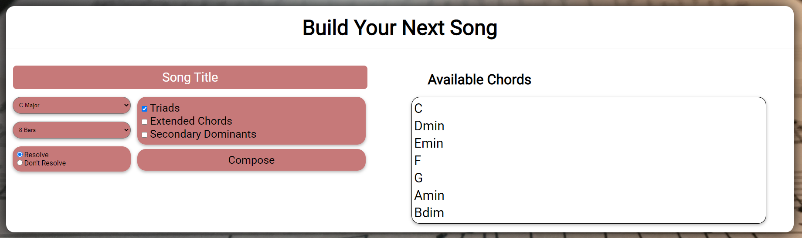
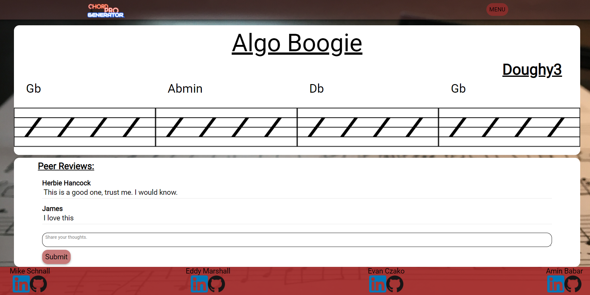

<p align="center">
  
</p>
<br></br>

<p align="center">
  
</p>
<br></br>

# [Chord Pro Generator](https://chord-pro-generator.herokuapp.com/#/login)

## Chord Pro Generator is a songwriting app that provides a road map for songwriters who are looking to write their next hit single! The app will generate templates upon which musicians can build their own unique masterpieces.
<br></br>

# Build
## Chord Pro Generator was built with  *MongoDB*, *Express*, *React*, *Redux*, and *Node.js*.
<br></br>

# Chord Pro Generator gives users the ability to: 
* Create and edit accounts. 
* Generate unique songs. 
* Choose different song-generating options: 
  * fully random
  * all diatonic
  * secondary dominant
  * extended chords
  * resolutions, and many more!
* Comment on other user's songs.
<br></br>

# Instructions
* Follow [this](https://chord-pro-generator.herokuapp.com/#/login) link to the website splash page.
* Either create a new user or log in with the demo-user button.
* Name your song.
* Choose a scale
* Generate a song
* Jam out!* Edit the song (in thedropdown menu on your post)* Delete it (if you don't like it)  
<br></br>

# Code
* The problem: how does one create a chord progression that sounds good and is still somewhat random? The solution, which I am proud of here is that I combined my knowledge of  harmonic functions in music theory with my knowledge of efficient algorithmic thinking to create two functions that work in tandem. One takes in a key and returns all of the chords in that key and the second organizes them by their harmonic functions so they can be used to create dynamic and varied chord progressions that always sound great. 
  ```
   //function to build four part chords
    buildExtendedChords(scale) {
        let extendedChords = [];
        for (let i = 0; i < scale.length; i++) {
            if (i === 0 || i === 3) {
                extendedChords.push(`${scale[i]}maj7`)
            } else if (i === 4) {
                extendedChords.push(`${scale[i]}7`)
            } else if (i === 1 || i === 2 || i === 5) {
                extendedChords.push(`${scale[i]}min7`)
            } else {
                extendedChords.push(`${scale[i]}min7b5`)
            }
        }
        return extendedChords
    }

    //function to classify harmonic functions of each chord 
    buildHarmonicFunctions(chords) {
        let ton = []
        let sub = []
        let dom = []

        for (let i = 0; i < chords.length; i++) {
            if (i === 0 || i === 5) {
                ton.push(chords[i])
            } else if (i === 1 || i === 3) {
                sub.push(chords[i])
            } else if (i === 4 || i === 6) {
                dom.push(chords[i])
            }
        }

        return {
            tonic: ton,
            subdominant: sub,
            dominant: dom
        }
    }
  ```


* This backend route allows us to gather all songs uploaded by a particular user without requesting any extraneous information from the backend.
```
   router.get('/user/:userId', (req,res) => {
      Song.find({songwriter: req.params.userId}, (err, songs) => {
         var songMap = {};
         songs.forEach((song) => {
               songMap[song._id] = song;
         });
         res.send(songMap);
      });
   });
```
<br></br>


## The user interface for composing a song:
<p align="center">
  
</p>
<br></br>

## The song show-page presented as sheet music to the user:
<p align="center">
  
</p>

<br></br>


# Resources

- The Github icon is from Github themselves!:
   - https://github.com/logos


- Linkedin icon is by artist: https://www.freepik.com
   - at: https://www.flaticon.com/free-icon/linkedin_1384072


# Contributers
## Evan Czako
[Github](https://github.com/EvanCzako) | 
[LinkedIn](https://www.linkedin.com/in/evan-czako/)

## Mike Schnall
[Github](https://github.com/mordes89) | 
[LinkedIn](http://linkedin.com/in/mike-mordechai-schnall)

## Eddy Marshall
[Github](https://github.com/EddyMarshall) | 
[LinkedIn](https://www.linkedin.com/in/eddy-marshall-092ba6b9/)

## Amin Babar
[Github](https://github.com/aminbabar) | 
[LinkedIn](https://www.linkedin.com/in/arbabar)
